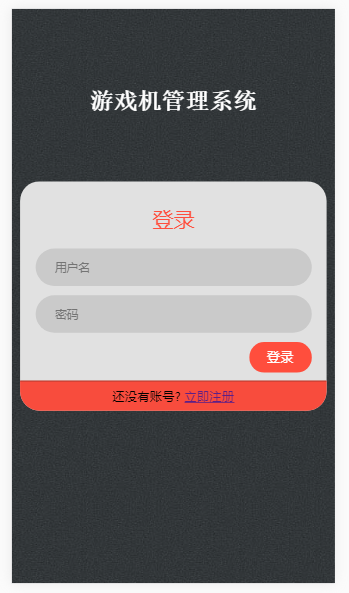
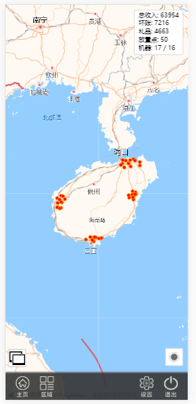
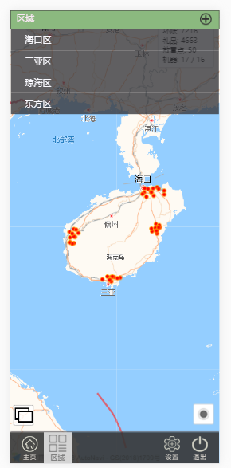
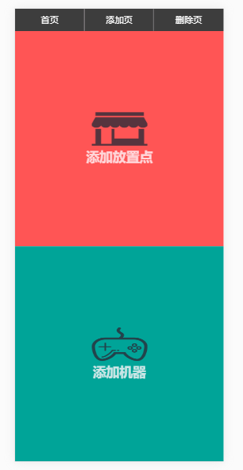
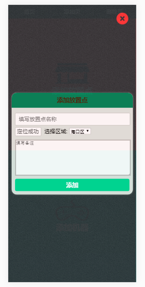
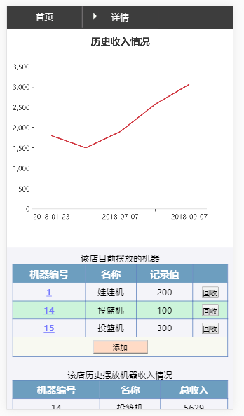
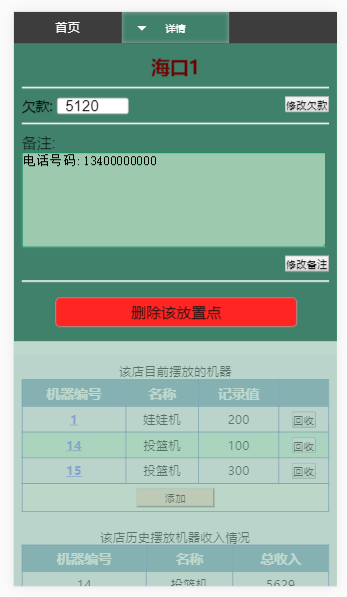
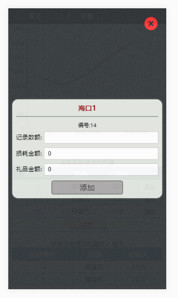

# analyze
一个图表项目---基于node.js和express
## 开发环境
- Node.js : '8.9.1'
- Express : '4.16.0'
- mongoose : '5.1.3'
## 目录结构
> 对应文件及文件夹的用处：
> - models: 存放操作数据库的文件
> - public: 存放静态文件，如样式、图片等
> - routes: 存放路由文件
> - views: 存放模板文件
> - index.js: 程序主文件
> - package.json: 存储项目名、描述、作者、依赖等等信息
>   
以上遵循了 MVC（模型(model)－视图(view)－控制器(controller/route)） 的开发模式。
## 模板引擎
- ejs
## 页面展示
### 登录页

### 登录后页面

### 选择具体区域

### 点击设置键跳转到设置页

### 选择具体设置对象

### 点击切换键后跳转到图表页

### 图表页选择区域后跳转到区域内各放置点页

### 放置点详情页

### 查看点详情

### 添加收入

